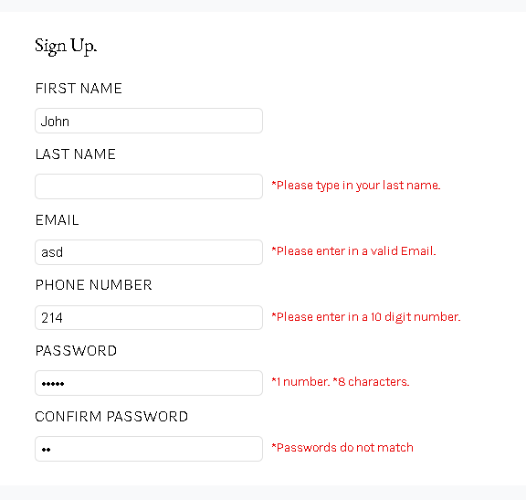

# Sign-Up Form Project

The goal of this repo is to practice the following skill sets:

- HTML
  - Forms
  - Labels & Input Elements
  - Built-in Validation
- CSS (Vanilla)
  - Pseudo-classes
  - Custom CSS Properties
  - Relative & Absolute Positioning
  - Responsive Design (Desktop only)
  - Typography
    - `line-height` & `letter-spacing`
  - "Basic" CSS Reset using `*` & `::before` / `::after`
- JavaScript
  - Custom form validation error messages
  - Array & `forEach` method
  - Password value comparison
  - Return values
- Chrome DevTools & Debugging
- Git Fundamentals

## Links
- [Live Demo](https://pb-5.github.io/Sign-Up-Form/)

## Summary 

The whole concept is a made up firm and the logo was custom as well. 

A combination of built-in HTML and JavaScript constraint validation were used to accomplish this project. I didn't want to aggressively alert the user of input errors before they had a chance to complete the form so validation occurs after the submit button is pressed for the first time.

The custom error messages appear when a user starts entering an input and unfocuses to a different field. The phone number and password have their own regex patterns and have to match the requirements the error indicates with the use of `validity.patternMismatch` and `validity.typeMismatch` for the email.

I have struggled to make the page responsive for different resolutions other than 1920x1080 this is because I found out that I have scaled my background image to that exact view in Photoshop. The script itself was also challenging when doing the password validity, but in the end I understood the concept of built-in js functions and using the test function to check for regex patterns.

## Screenshots

